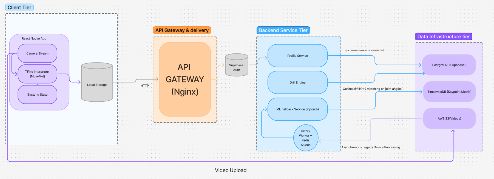

# BadmintonIQ 🏸

> AI-powered badminton technique coach — real-time pose analysis,
> pro player style matching, and personalised drill recommendations.

## What it does

This aims to improve the skills of any beginner to intermediate level badminton player by analysing the players movements and suggesting posture correction and drills so that the player can improve their game

## Architecture

## Stack

| Layer   | Technology                 |
| ------- | -------------------------- |
| Mobile  | React Native (Expo)        |
| Backend | FastAPI + PostgreSQL       |
| ML      | MoveNet + PyTorch → TFLite |
| Infra   | AWS ECS + Terraform        |

## Getting started

### Prerequisites

### Mobile app

### Backend

## Project structure

badmintoniq/
├── apps/
│ ├── mobile/ ← Expo React Native app (Phase 1)
│ └── backend/ ← FastAPI server (Phase 1)
├── ml/
│ ├── pipeline/ ← The POC code we just built
│ ├── models/ ← TFLite model files (gitignored, stored in S3)
│ ├── training/ ← PyTorch training scripts (Phase 2)
│ └── data/ ← Dataset scripts and labels (gitignored)
├── infra/
│ ├── terraform/ ← AWS infrastructure as code (Phase 4)
│ └── docker/ ← Dockerfiles for each service
├── docs/
│ ├── PRD_v1.0.docx
│ ├── TRD_v1.0.docx
│ └── architecture/ ← diagrams, ADRs
├── .github/
│ └── workflows/ ← GitHub Actions CI/CD
├── .gitignore
└── README.md

## Status

🚧 Active development — Phase 1 (Foundation)
